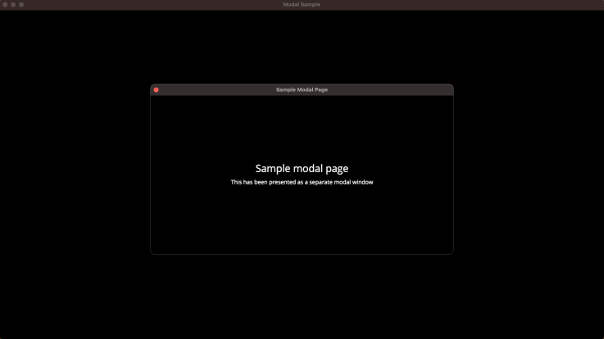
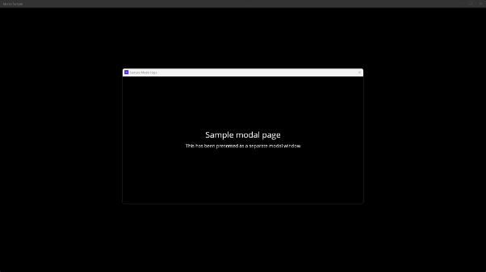
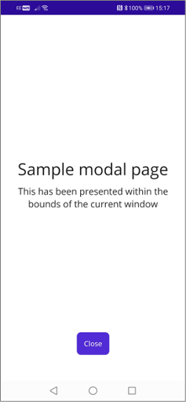
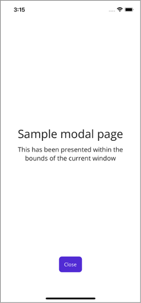

# Modal windows for .NET MAUI desktop apps

The following is a quick prototype exploring the use of modal windows in .NET MAUI apps targeting desktop platforms. This has been created to experiment with potential approaches and as input into the [Modal windows for desktop apps](https://github.com/CommunityToolkit/Maui/issues/842) proposal on [.NET MAUI Community Toolkit](https://github.com/CommunityToolkit/Maui). The prototype reflects the high-level approach outlined in that proposal.

## Sample

The **Modals Sample** app presents a modal ```Page``` (**ModalPage**) when clicking / tapping on the 'Show Modal' ```Button``` on **MainPage**. When run on a mobile device, the ```Page``` is presented modally within the current screen. On desktop platforms, where the app supports multi-window, the ```Page``` is presented in a separate modal window.

<p>
 

</p>

### Indicative flow

The ```Button``` **Clicked** handler uses a version of the existing [INavigation.PushModalAsync](https://learn.microsoft.com/dotnet/api/microsoft.maui.controls.inavigation.pushmodalasync?view=net-maui-7.0)  method called ```PushModalAsyncEx``` to present **ModalPage**. When used on desktop apps supporting multi-window, the ```Page``` is presented in a separate modal window. Otherwise, ```PushModalAsysncEx``` uses the original [INavigation.PushModalAsync](https://learn.microsoft.com/dotnet/api/microsoft.maui.controls.inavigation.pushmodalasync?view=net-maui-7.0) method to present the ```Page``` within the curent screen.

```csharp
void ShowModalButtonClicked(object sender, EventArgs e)
    => _ = Navigation.PushModalAsyncEx(new ModalPage(), Window.Width / 2, Window.Height / 2);
```

In this example, a width and height are provided for the modal window so it appears as half the size of the ```Window``` it was opened from. 

For those platforms supporting multi-window, **ModalPage** is dismissed by closing the host modal window itself. If multi-window is not supported on a given platform, the **ModalPage** shows a 'Close' ```Button``` so the modal can be dismissed via [INavigation.PopModalAsync](https://learn.microsoft.com/dotnet/api/microsoft.maui.controls.inavigation.popmodalasync?view=net-maui-7.0#microsoft-maui-controls-inavigation-popmodalasync). 

<p>


</p>

The visibility of the 'Close' ```Button``` is determined using a convenience method called ```ModalWindowsSupported```.  

```csharp
protected override void OnAppearing()
{
    base.OnAppearing();

    var modalWindowsSupported = Navigation.ModalWindowsSupported();
    CloseButton.IsVisible = !modalWindowsSupported;
}

void CloseButtonClicked(object sender, EventArgs e)
    => _ = Navigation.PopModalAsync();
```

## Key considerations

As described in the [Modal windows for desktop apps](https://github.com/CommunityToolkit/Maui/issues/842) proposal itself, there's several potential risks and considerations. Notably:

1. Potential to miss key details of the implementation when orchestrating several separate lower-level APIs or not anticipating things that may impact the modal behavior and / or overall experience.
1. The approach depends on use of platform APIs not directly exposed by the MacCatalyst / WinUI SDKs. There's a risk that future platform updates may introduce breaking changes, remove, or perhaps prevent use of those APIs. This could include changes in app store policies impacting the ability to use of those APIs which, if detected, may be considered grounds for rejection during the app store review processes.